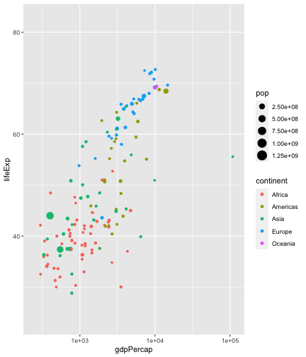
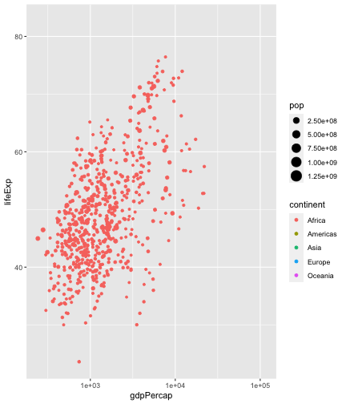
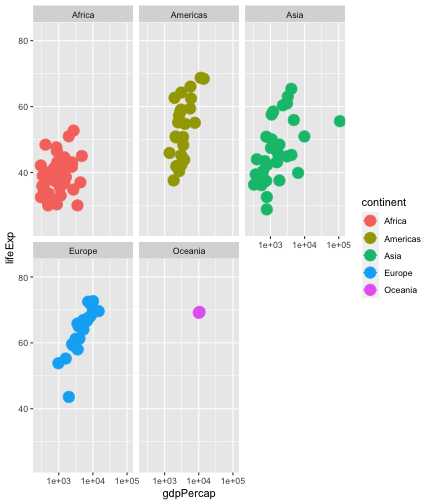
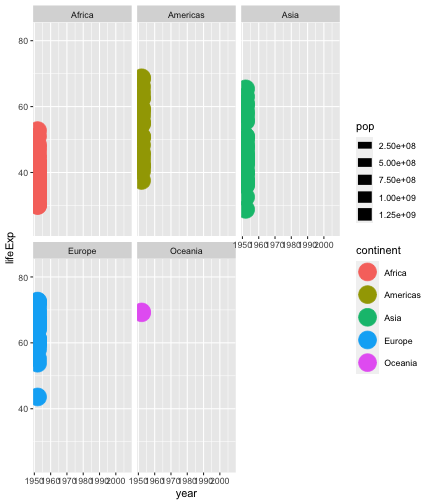

```{r, echo = F}
library(viztoc)
# viztoc::build_and_use_gif
knitr::opts_chunk$set(echo = F, eval = T, message = F, warning = F, cache = F)
update <- T
```


```{css}
.static {
  position:absolute;
  background: white;
}

.static:hover {
  opacity:0;
}
```

<!-- <a href="https://evamaerey.github.io/flipbooks/about" target="_blank"></a> -->

<!-- **Homer dips his toe into some Data Viz! Leaving him here just for Data Viz Spring 2020!** -->


Welcome to *a ggplot2 grammar of guide*!  This guide isn't comprehensive, and it will likely continue to evolve.  But it's at a place that it might be useful to orient you, a colleague, or a student to ggplot2 and extensions.  

ggplot2 is an open source software package and implementation of the '**G**rammar of **G**raphics' framework.  I'm grateful to the package creator Hadley Wickham and the ggplot2 team that has worked so hard to creating this incredible tool, to the contributors and maintainers of the R language in which it is built, and to folks who have given me valuable feedback on communicating data viz and data viz tools, especially my students!

### Getting Started

Right now, you're actually on the *visual table of contents* page for quick reference.     

But you can [get started with the guide itself here](ggplot2_grammar_guide.html){target="_blank"}, which contains a guided discussion for thinking about data viz and ggplot2, and code+output walk-throughs for getting the work done.  

> first grammar lesson:  *A data visualization, is composed of geometric shapes, that take on aesthetics which represent variables from a data set. * **ggplot() + aes() + geom_\*\(\)**

### VizTOC

To use the visual table of contents, mouse over to see a preview of what will be covered, then click any link or visual preview to go through to the flipbook (code-movies built with the flipbookr and xaringan packages) that will show you a detailed build of the previewed contents. 

<!-- ggplot2 is based on the grammar of graphics.  But it has its *own* grammar too --- it is a *particular* implementation of the grammar of graphics --- and a lot of really helpful decisions are part of its grammar (like having set defaults for aesthetic scales, and scale and plot labels make it easier to build plots quickly).  If you are teaching ggplot2, you might think about teaching the grammar of ggplot2 *first* and then come back to the *grammar of graphics* --- because there will be more context for seeing how an implementation relates to the larger philosophy.  There are a lot of great resources out there already teaching the grammar of graphics which are sources of inspiration for the *guide*.   -->

*Not into human language grammar?  Just ignore that first column!*

<!-- > ggplot2 is the "programmatic reflection of [the grammar of graphics] theory" - Thomas Lin Pederson -->

<!-- > mapped aesthetics are the "graphical properties of the geometries."  -->

<!-- > scales translate back and forth between values in variables and percievable properties.  -->

<!-- > "geometries are pretty much all you think about all the time" - no -->

<!-- > "basic geometries"  boxplot - rectangle and some lines... -->

<!-- > "globular..." -->

<!-- > "color profile"  in printing... -->

<!-- > theme doesn't flow from the data itself...  "aesthetically pleaseing plots are more readable and likeable, but doesn't relate to the data" -->


<!-- > "legends guides axes are instrumental to understanding the plot - how can I interpret these graphical properties" -->

<!-- Of course it's interesting to teach the grammar of graphics along with ggplot2 --- ggplot2 is an implementation of the grammar of graphics.  But ggplot2 has its own grammar, so if you are teaching that tool, might as well teach that specific grammar.  --> 

<!-- > guides... -->

<!-- > setting aesthetics, vs mapping aesthetics... -->


| | What? |  |  How?  
---|---|---|---
1. **The Declarative Mood** | [Declaring the **data**](data_aes_geom.html){target="_blank"}| | ggplot(data = gapminder) +
2. **The Interogative Mood**  | [Asking for **representation of variables by aesthetics** (color, size, x position, etc.) (also known as **aesthetic mapping**) ](data_aes_geom.html#aes){target="_blank"}   | `r viztoc:::build_and_use_gif(dir = "data_aes_geom_files/figure-html/", pattern = "area", href = "data_aes_geom.html", width = 100, height = 100, delay = .25, cached_gif = update, which = 8)` | aes(**color** = pop) +
    **- Modifiers I** | [modifying *default* **aesthetic labels** (and **plot labels**)](modifiers.html#labs){target="_blank"} | `r viztoc:::build_and_use_gif(dir = "modifiers_files/figure-html/", pattern = "labs", href = "modifiers.html#labs", which = 11, width = 100, height = 100, cached_gif = update, delay = .22)`| *labs(**color** = "Continent") +<br>labs(title = "my title") +*
    **- Modifiers II**  | [modifying the *default* **coordinate system** (how the *positional* aesthetics appear - x and y)](modifiers.html#coords){target="_blank"}  | `r viztoc:::build_and_use_gif(dir = "modifiers_files/figure-html/", pattern = "coords", href = "modifiers.html#coords", which = 7, width = 100, height = 100, cached_gif = update, delay = .22)`| coord_polar() + 
    **- Modifiers III** | [modifying *default* **aesthetic scales**](modifiers.html#scales){target="_blank"} | `r viztoc:::build_and_use_gif(dir = "scales_files/figure-html/", pattern = "", href = "scales.html", which = 54, width = 100, height = 100, cached_gif = update, delay = .22)`| *scale\_**color**\_viridis_d() +* 
3. **Nouns**  | [**geometric layers** taking on the aesthetics representing variables](data_aes_geom.html){target="_blank"} | **see below table** | *geom\_point() +*
4.**The Conditional Mood**| [Making **local**, **geom-specific** declarations rather than **global** declarations](local.html){target="_blank"} ||*geom\_point(* 
|  | **data** is <br> geom-specific  |`r viztoc:::build_and_use_gif(dir = "local_files/figure-html/", pattern = "data", href = "local.html", width = 100, height = 100, cached_gif = update, delay = .22)`|  &nbsp;&nbsp;&nbsp;&nbsp;&nbsp;&nbsp;&nbsp;&nbsp;&nbsp;&nbsp;&nbsp;&nbsp;&nbsp;&nbsp;&nbsp;&nbsp;*data = gapminder,*
  |  |  **aesthetic representation**<br> is geom-specific  | `r viztoc:::build_and_use_gif(dir = "local_files/figure-html/", pattern = "aes_mapping", href = "local.html", width = 100, height = 100, cached_gif = update, delay = .22)`|  &nbsp;&nbsp;&nbsp;&nbsp;&nbsp;&nbsp;&nbsp;&nbsp;&nbsp;&nbsp;&nbsp;&nbsp;&nbsp;&nbsp;&nbsp;&nbsp;*aes(**size** = population),*
| |  **aesthetics *not* representing variables; *unmapped* aesthetics** (i.e.  **The Imperative Mood)**  | `r viztoc:::build_and_use_gif(dir = "local_files/figure-html/", pattern = "unmapped", href = "local.html", width = 100, height = 100, cached_gif = update, which = 9, delay = .22)`|  &nbsp;&nbsp;&nbsp;&nbsp;&nbsp;&nbsp;&nbsp;&nbsp;&nbsp;&nbsp;&nbsp;&nbsp;&nbsp;&nbsp;&nbsp;&nbsp;***color** = "blue"<br>* 
|||| ) + 
5. **Interjections**| [Adding context with **annotation layers**](annotate.html){target="_blank"} |  `r viztoc:::build_and_use_gif(dir = "annotate_files/figure-html/", pattern = "", href = "annotate.html", which = 7, width = 100, height = 100, cached_gif = update, delay = .22)` | *annotate(geom = "point", <br>&nbsp;&nbsp;&nbsp;&nbsp;&nbsp;&nbsp;&nbsp;&nbsp;&nbsp;&nbsp;&nbsp;&nbsp;&nbsp;&nbsp;&nbsp;&nbsp; x = 10, <br>&nbsp;&nbsp;&nbsp;&nbsp;&nbsp;&nbsp;&nbsp;&nbsp;&nbsp;&nbsp;&nbsp;&nbsp;&nbsp;&nbsp;&nbsp;&nbsp; y = 12, <br>&nbsp;&nbsp;&nbsp;&nbsp;&nbsp;&nbsp;&nbsp;&nbsp;&nbsp;&nbsp;&nbsp;&nbsp;&nbsp;&nbsp;&nbsp;&nbsp; color = "blue")* 
6. **Punctuation**  | [**faceting** breaks a plot into small plots (or *"small multiples"*) based on categorical variables ](facet.html){target="_blank"} |  `r viztoc:::build_and_use_gif(dir = "facet_files/figure-html/", pattern = "", href = "facet.html", which = 6, width = 100, height = 100, cached_gif = update, delay = .22)`| *facet_wrap(~continent)*
7. **Greetings**| [**themes** changing plot look and feel](themes.html){target="_blank"}   | `r viztoc:::build_and_use_gif(dir = "themes_files/figure-html/", pattern = "", href = "themes.html", which = 55, width = 100, height = 100, cached_gif = update, delay = .22)` | *theme_minimal()*
8. **The Written Language** | [save plots with different **resolutions** and **file formats**](ggsave.html){target="_blank"}| | *ggsave(file = "plot.png", <br> plot = g, <br>  height = "4in", <br> width = "6in")*
9. **Composition** | [Composing plots into ensembles](ensembles.html){target="_blank"} | `r viztoc:::build_and_use_gif(dir = "ensembles_files/figure-html/", pattern = "", href = "ensembles.html", which = 84, width = 100, height = 100, cached_gif = update, delay = .22)`| *library(patchwork) <br> (g1 + g2) \| g3 <br> <br> library(cowplot) <br> plotgrid(...,)*  
10. **Concision** | [We've been intentionally verbose, but there are strategies for being concise](concision.html){target="_blank"} | | last_plot(), switch out data with `%+%`, writing functions 

---

```{r}
library(viztoc)
```


<!-- - *Modifiers IV* | guides() + | [to be added?] -->

### A closer look at geoms.

Above, the geom topics are intentionally cursory.  There are tons of geoms -- like nouns -- and they can get distracting I find them to not be very grammatical -- like nouns -- and earlier we wanted to focus on grammar. But in the end, geoms are pretty fun - and there are a lot of them! Below gives you a preview of geometric marks used to describe continuous distributions, continuous-continuous joint distributions, visualizations of single series, of multiple series and discrete-discrete distributions.  In the area of geoms, there have been many contributors 

```{r}
p <- "geoms_files/figure-html/"
```


<!-- r viztoc:::build_and_use_gif(path = "scales_files/figure-html/", pattern = ".")` -->


<div id="needtowrap">

```{r, echo=F}
library(viztoc)
# build_and_use_gif()
# special_viztoc <- function(){
#   
#   build_and_use_gif()
#   
# }

```


`r viztoc:::build_and_use_gif(dir = "geoms_continuous_distribution_files/figure-html/", pattern = "", href = "geoms_continuous_distribution.html", width = 150, height = 150, cached_gif = update, which = 35, delay = .22)`

`r viztoc:::build_and_use_gif(dir = "geoms_bivariate_continuous_files/figure-html/", pattern = "", href = "geoms_bivariate_continuous.html", which = 12, width = 150, height = 150, cached_gif = update, delay = .22)`

`r viztoc:::build_and_use_gif(dir = "geoms_single_series_files/figure-html/", pattern = "" , href = "geoms_single_series.html", width = 150, height = 150 , which = 8, cached_gif = update, delay = .22)`

`r viztoc:::build_and_use_gif(dir = "geoms_multi_series_files/figure-html/", pattern = "" , href = "geoms_multi_series.html", width = 150, height = 150 , cached_gif = update, delay = .22)`

`r viztoc:::build_and_use_gif(dir = "geoms_discrete_discrete_files/figure-html/", pattern = "" , href = "geoms_discrete_discrete.html" , width = 150, height = 150, cached_gif = update, delay = .22)`


  
  
</div>

  
```{css, echo = F}
#needtowrap {
  -webkit-columns: 5;
  -moz-columns: 5;
  columns: 5;
}
#needtowrap p {
  margin: 0;
}
#needtowrap p + p {
  text-indent: 1em;
}

```
  

```{r, out.width="12%", echo= F}
# build_and_use_gif(path = "geoms_files/figure-html/", 
#           pattern = "ref_lines")
```       
    

---

### A Closer Look at Color

- [color theory](color.html){target="_blank"}
- [named colors in R](named_colors.html){target="_blank"}
- [paletteer's](paletteer.html){target="_blank"} large collection of palettes

`r viztoc:::build_and_use_gif(dir = "paletteer_files/figure-html/", pattern = "", href = "paletteer.html", which = 32, width = 250, height = 250, cached_gif = update, delay = .22)`

### A Closer Look at Text

- font? someday
- [{ggtext} allows variation in color, font type, etc within text](https://evamaerey.github.io/flipbooks/ggtext/ggtext){target="_blank"}


External Theme Packages

- [{ggeasy} easy adjustment for common theme modifications](themes_ggeasy.html){target="_blank"}
- [External Themes, {ggthemes} {ggthemr}](external_themes.html){target="_blank"}

Spatial with [geom_sf](geom_sf.html){target="_blank"}, [tmap](tmap.html){target="_blank"}, and [rayshader](rayshader.html){target="_blank"} (topography & 3D ggplots)

<div id="needtowrap">

`r viztoc:::build_and_use_gif(dir = "geom_sf_files/figure-html/", pattern = "" , href = "geom_sf.html", width = 150, height = 150, cached_gif = update, which = 19, delay = .22)`

`r viztoc:::build_and_use_gif(dir = "tmap_files/figure-html/", pattern = "" , href = "tmap.html" , width = 150, height = 150, cached_gif = update, which = 45, delay = .22)`

`r viztoc:::build_and_use_gif(dir = "rayshader_files/figure-html/", pattern = "" , href = "rayshader.html", width = 150, height = 150, cached_gif = update, which = 14, delay = .22)`


</div>

<br>


---


Network visualization [{ggraph} and {tidygraph}](ggraph.html){target="_blank"} 

`r viztoc:::build_and_use_gif(dir = "ggraph_files/figure-html/", pattern = "" , href = "ggraph.html" , width = 250, height = 250, cached_gif = update, which = 10, delay = .22)`

---

Animation with [{gganimate}](gganimate.html){target="_blank"} (No hyperlinks currently on gifs. Click gganimate link to the left)

```{r, out.width="24%", fig}




```

*There's not as much as I'd like here.  Some gganimate <-> flipbookr struggle.  But perhaps still useful as a starting point. *


```{css, echo = F}
.button {
  background-color: #4682b4; /* Blue */
  border: none;
  color: white;
  padding: 15px 32px;
  text-align: center;
  text-decoration: none;
  display: inline-block;
  font-size: 16px;
}
```


# Other guides to ggplot2

ggplot2 is very flexible, so there often there are more than one way of getting things done --- which also means there is more than one way to introduce ggplot2.
If you aren't on board with this guide (and even if you are) you may want check out other resouces --- I've learned a so much from them!  The definitive and comprehensive guide to ggplot2 is the 3rd edition of [*ggplot2: elegant graphics for data analysis*](ggplot2-book.org){target="_blank"}. Some other workshop materials are Alison Hill's [Take a Sad Plot and Make it Better](https://alison.netlify.app/rlm-sad-plot-better/#1), Garrick Aden-Buie's [*A Gentle Guide to the Grammar of Graphics with ggplot2*](https://pkg.garrickadenbuie.com/gentle-ggplot2/#1){target="_blank"}, Will Chase's [*R you ready to make charts?*](https://www.williamrchase.com/slides/ggplot_intro.html#1){target="_blank"}, Malcom Barrett's [*Designing ggplots making clear figures that communicate*](https://designing-ggplots.netlify.com/#1){target="_blank"}, and Thomas Lin Pederson's [*Drawing anything with ggplot2*](https://github.com/thomasp85/ggplot2_workshop/blob/master/presentation.pdf){target="_blank"}.  [The ggplot2 cheatsheet](https://rstudio.com/wp-content/uploads/2015/03/ggplot2-cheatsheet.pdf){target="_blank"} is also excellent. 


<!-- --- -->

<!-- # Navigating the grammar guide -->

<!-- <a href="navigate.html" class="button">Suggested Navigation</a> -->

---


# Other Chapters


```{css, echo = F}
.button {
  background-color: #4682b4; /* Blue */
  border: none;
  color: white;
  padding: 15px 32px;
  text-align: center;
  text-decoration: none;
  display: inline-block;
  font-size: 16px;
}
```

<a href="https://evamaerey.github.io/data_manipulation/about" class="button">Data Wrangling</a>
<a href="https://evamaerey.github.io/statistics/about" class="button">Statistical Analysis</a>


