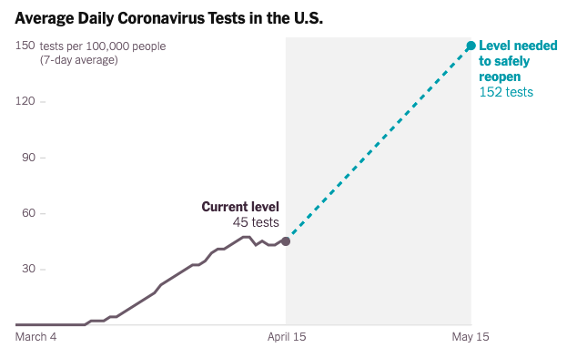

class: left, top, inverse
background-image: url(https://images.unsplash.com/photo-1516741539888-96b4c96adf0c?ixlib=rb-1.2.1&ixid=eyJhcHBfaWQiOjEyMDd9&auto=format&fit=crop&w=1867&q=80)
background-size: cover

# .large[A viz about the fish market]
### Context for understanding a resource conflict

<br>
<br>
<br>
<br>
<br>
<br>
<br>
<br>
<br>
<br>


#### .right[[https://en.wikipedia.org/wiki/Fishing_industry_by_country](https://en.wikipedia.org/wiki/Fishing_industry_by_country)<br>Edited: Gina Reynolds<br>Photo Credit: jean wimmerlin]

```{r setup, include = F}
# This is the recommended set up for flipbooks
# you might think about setting cache to TRUE as you gain practice --- building flipbooks from scracth can be time consuming
knitr::opts_chunk$set(fig.width = 6, message = FALSE, warning = FALSE, comment = "", cache = T, fig.retina = 3)
library(flipbookr)
library(tidyverse)
```

---

```{r, echo = F}
knitr::opts_chunk$set(message = F, warning = F)
```

# Overview

In the following lab, you will *answer some questions* and *create an annotated plot*. Create an .Rmd file and work within it. Submit an html in Canvas. 


---

In 1879–1883, Chile and Peru fought a war over resources.  What is the name of that war and what resource(s) were involved?  What other counrtry was involved? Not sure? You can search the web for this answer. 

> Answers the question in your .Rmd

More recently a case was brought to the ICJ again over resources. *In a few sentences summarize the dispute.* Reference: https://www.icj-cij.org/en/case/137

> Answers the question in your .Rmd


---

Now, check out the maps in the judgement:  https://www.icj-cij.org/files/case-related/137/137-20140127-JUD-01-00-EN.pdf
In these maps, the water is colored blue. *Now, what color is the land?*  

> Answers the question in your .Rmd

*How are the maps used to illuminate the dispute and ICJ's resolution of the dispute?  Which pages of the document contain these two maps?*

> Answers the question in your .Rmd

*Beyond fishing, name a one commodity for Chile's and one of Peru's of great importance for each state's economy.* You may search the web!

---

### The data

Fisheries and Aquaculture Department of the Food and Agriculture Organization of the United Nations collects data on fisheries production of countries. [This Wikipedia page](https://en.wikipedia.org/wiki/Fishing_industry_by_country) 
lists fishery production of countries for 2005. For each country tonnage from 
capture and aquaculture are listed. Note that countries which harvested less 
than 100,000 tons are not included in the data. 

--

Data cleaning steps are here: https://evamaerey.github.io/data_manipulation/data_cleaning/data_cleaning#16

What are two or three of the steps in the data cleaning pipeline?

> answer in the .Rmd


---

### Use the prepped data in the assignment.  Include the code below, by pasting it into a code chunk in your .Rmd. and executing.


```{r}
fisheries <- readr::read_csv("https://raw.githubusercontent.com/EvaMaeRey/ggplot2_grammar_guide/master/exercises/fisheries.csv")
fisheries_peru_chile <- readr::read_csv("https://raw.githubusercontent.com/EvaMaeRey/ggplot2_grammar_guide/master/exercises/fisheries_peru_chile.csv")
```

---
class: center, inverse, middle

# Task 1: Highlighting and storytelling


---

In addition to answering the questions above, using the `fisheries` and `fisheries_peru_chile` data frames, and create the following plot.   


```{r var1, echo = F, eval = T}
# so scientific notation doesnt turn on too quick
options(scipen = 10) 
ggplot(data = fisheries) +
  aes(x = capture) +
  aes(y = aquaculture) +
  geom_point() + 
  scale_x_log10() + 
  scale_y_log10() +
  aes(color = peru_or_chile) +
  scale_color_manual(
    values = c("grey", "steelblue")
    ) +
  aes(label = country) +
  geom_text(aes(alpha = peru_or_chile),
            nudge_y = .3, 
            fontface = "bold") +
  scale_alpha_discrete(range = c(0,1)) +
  theme_minimal() +
  theme(legend.position = "none") + 
  annotate(geom = "text",
           x = 200, 
           y = 3000000,
           label = "Chile and Peru's fish production\nis some of the highest\nin the world",
           color = "steelblue",
           fontface = "bold",
           hjust = 0
           )
```


What follows are some hints about how to get it done --- what you might see as yo u build up your plot with the fisheries data. 

---

`r chunk_reveal("data_layer", display_type = "output")`

```{r data_layer, include = F}
# Your ggplot here
ggplot(data = fisheries) +
  aes(x = capture) +
  aes(y = aquaculture) +
  geom_point(color = "grey") + 
  scale_x_log10() + 
  scale_y_log10() +
  geom_point(data = fisheries_peru_chile,
             color = "steelblue") +
  geom_text(data = fisheries_peru_chile,
            aes(label = country),
            color = "steelblue",
            nudge_y = .3,
            fontface = "bold") +
  theme_minimal() + 
  annotate(geom = "text",
           x = 300, 
           y = 3000000,
           color = "steelblue",
           label = "Chile and Peru's fish production\n is some of the highest\nin the world",
           fontface = "bold"
           )
```


---

# An ugly plot for reference

--

You also might have a look at the code that follows for reference for your peru-chile assignment.

---

`r chunk_reveal("ugly", display_type = "both")`

```{r ugly, include = F}
library(gapminder)
gapminder %>% 
  filter(year == 2002) ->
gm_2002

gm_2002 %>% 
  filter(continent == "Americas") ->
gm_2002_am

ggplot(gm_2002) +
  aes(x = gdpPercap) +
  aes(y = lifeExp) +
  geom_point(color = "pink") +
  geom_point(data = gm_2002_am,
             color = "green") +
  geom_text(data = gm_2002_am,
            aes(label = country), # label should
            color = "red", # be country name
            nudge_y = 1.5) + 
  annotate(geom = "tile",
           x = 30000, # required aesthetics
           y = 55, # required aesthetics
           width = 10000, # optional aesthetics
           height = 5, # optional aesthetics
           fill = "orange") + # optional aesthetics
  annotate(geom = "label",
           x = 30000, # required aesthetics
           y = 55, # required aesthetics
           label = "A tile!", # required aesthetics
           size = 9, # optional aesthetics
           fill = "magenta", # optional aesthetics
           color = "oldlace") # optional aesthetics
```

---
class: inverse, middle, center

# Task 2: Emulate

---

## Look at the New York Times figure.  



--

### Part of the plot is *data* based, but part is annotation.  

---

### Task 2, assignment details.

In the next slides, I show you how to create some toy data, tracking price over some days, and created the *data* based part of this graph.  Use this as your code as the basis for your work. 

Add layers (geom or annotation) so that you have a similar plot to the New York times plot. In other words, add a point at the end of the data series.  Add a segment that connects that point to 3X the value of the variable `price` and is +30 time units from the last observed `time_period` unit. Add a point at the end of the segment.  Add text that comments on these points.  

Hint: You'll probably want to use "segment" in an annotation layer.  To see the required aesthetics, search geom_segment in the help panel.  

*Bonus*: Create the gray background that indicates the portion of the plot in the future - the portion with the desirable trajectory. 

*Not* required: Adjusting x and y axis labels and breaks and break labels.  


---

`r chunk_reveal("toy_data")`

```{r toy_data, include = F}
set.seed(14392) # everyone's randomly created data is same 
runif(30) %>% 
  cumsum() %>% 
  sqrt() %>% 
  tibble(price = .) %>% 
  mutate(time_period = row_number()) ->
growth_data

ggplot(data = growth_data) +
  aes(x = time_period) +
  aes(y = price) +
  geom_line() +
  coord_cartesian(xlim = c(0, 80),
                  ylim = c(0, 14))
```


---
class: inverse, middle, center

# Task 3:  Reflect


---


### 3a. Also in your .Rmd, describe how the two approaches differ to creating visualizations of NHL goals over time in the walk-through on slide "20/21".

https://evamaerey.github.io/ggplot2_grammar_guide/geoms.html#130


### 3b. Describe some of the different annotation strategies: 

https://evamaerey.github.io/ggplot2_grammar_guide/labeling_time_series#1

Note:  I wouldn't recommend using gghighlight at this point.  I think the package maybe isn't as mature as it needs to be.


```{css, eval = TRUE, echo = FALSE}
.remark-code{line-height: 1.5; font-size: 60%}
```

